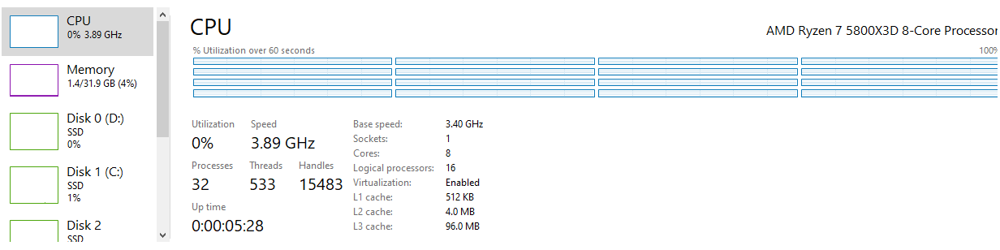
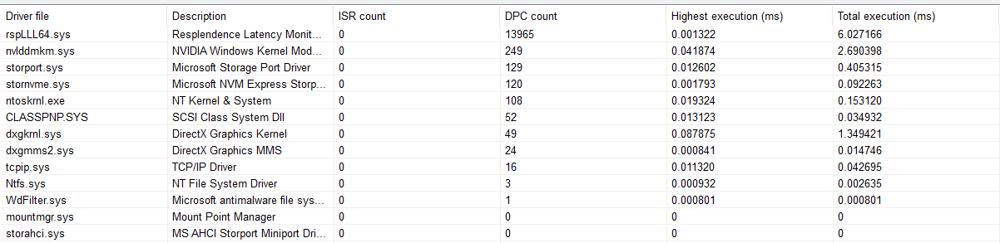

# Gaming OS Tweaker

> [!WARNING]  
> I dont plan on continue maintaining the project, I might only unarchive if there is something meaningful to be added/changed, I am also no longer accepting PRs nor looking for anything. I put it back in a org because more people contacted me about the project through email.

> [!NOTE]  
> For my last commit. It's now completely optimized in every point, no point in wasting more time on tweaks, just enjoy gaming sessions instead, that's obviously the whole point.

> Attempts to debloat, keep low input lag, low latency, better hitreg and improved performance.

```txt
I am not responsible for any damage the scripts could cause.

You are responsible for your own machine, and whatever you do in it.

Make sure you create a System Restore Point before running any scripts.
```

> Know that if you execute all the scripts, it will make your OS for games only, that is the focus. Dont expect to be usable for your everyday everything.

> Do not blindly apply everything without even understanding what you are doing, I recommend checking each script before doing so. Some have comments about certain choices in them.

> It will NOT leave your OS secure, because scripts will remove and/or disable all of Windows Defender ecosystem features in favor of performance. You need your good sense and just play games safely, like the ones installed by clients, e.g., steam, battle.net, etc.. Although I left some security options in [scripts/optional_helpers/install_apps.cmd](/scripts/optional_helpers/install_apps.cmd) in the security section.

> These scripts will NOT give you some super advantage, it's always been about having your system running at it's best, latency and performance wise. Given that, by default, that has never been a priority for Microsoft. As they prioritize their whole ecosystem, rather than just gaming.

> If you have something additional to contribute, please open an issue or create a PR.

---

### How to

> If you need to download a fresh OS ISO directly from Microsoft, follow the guide at [WINDOWS_DOWNLOAD_GUIDE](/docs/WINDOWS_DOWNLOAD_GUIDE.md)

- Create a system restore point.
- Run scripts from `scripts/debloat` folder first, and `scripts/tweaks` after.
- I recommend to at least also run the `install_apps.cmd` from `scripts/optional_helpers/` folder, before debloat scripts. | *There are other useful scripts in there.*
- (Win11 only) Recommended to look at the `scripts/optional_helpers/remove_windows_defender.cmd` before all other scripts.
- **For every `.cmd` script you run, run as administrator.** | *It's not enforced, but the scripts will NOT work, if you dont run as admin.*
- Reboot and Done!

> I would say to install everything that you need and configure (from docs and else), before creating the next restore point, because restore point could break, at least it does in Win11, after you run debloat scripts. At least you will have that point to restore. Though I suppose services script from debloat could be why, leave it for last.

> To uncomment a line, you remove the `#` or `::` from before the command. Might be useful in certain cases.

> Not all scripts are dependent on some tool, but some are, you should consider downloading the whole `gaming_os_tweaker` folder to use any script. Easiest way is to click on the button `<> Code` and `Download ZIP`.

> After running the scripts, follow some guides from the `docs` folder.

- [GPU_GUIDE](/docs/GPU_GUIDE.md)
- [OTHERS_GUIDE](/docs/OTHERS_GUIDE.md)
- [AUDIO_GUIDE](/docs/AUDIO_GUIDE.md)
- [CPU_GUIDE](/docs/CPU_GUIDE.md)
- [RAM_GUIDE](/docs/RAM_GUIDE.md)
- [BIOS_GUIDE](/docs/BIOS_GUIDE.md)
- [PERIPHERALS_GUIDE](/docs/PERIPHERALS_GUIDE.md)
- [SECURITY_GUIDE](/docs/SECURITY_GUIDE.md)
- [LINUX_GAMING_GUIDE](/docs/LINUX_GAMING_GUIDE.md)
- [CONSOLE_GUIDE](/docs/CONSOLE_GUIDE.md)
- [WINDOWS_SNAPSHOT_GUIDE](/docs/WINDOWS_SNAPSHOT_GUIDE.md)

---

You can verify the repository, by downloading with `Download ZIP` and verifying at [VirusTotal](https://www.virustotal.com/).

Here is an [Example](https://www.virustotal.com/gui/file/de761e6eae9de1d8b18599c1e9982c0a528c7770fc7bfe363faace7dab59698b/detection), there are red flags, though if you look at the Relations tab, you will see that they are from scripts and from the nvidiaProfileInspector.

---

### Result

From a fresh Windows 10 22H2 install and completely updated, and applying the scripts from this repo, it was reduced to `32` processes, with Nvidia Driver (debloated) in the background and Task Manager.

No additional tools were used.

It's a very clean OS, while being decently functional. Task Scheduler and UAC (minimum) are kept enabled. Windows Update are disabled due to not being able to complete installation.

In my 5800X3D, the average DPC Latency are at `0.7` (Win10). It's probably less on Intel. With the CPU idle state disabled, it was able to be on `0.5` average. But the average fps in Overwatch 2 for example were less than when enabled.

Good reference: <https://docs.google.com/document/d/1ILugrwtHfmisYzI1MdCOhSzBPuLJPi5D7xYJgQ4sxDM/edit#heading=h.mjyvqzxoctd0>

To give some perspective on the FPS, previously I was on Win11 only with some tweaks and debloat changes. I had to use the nvidia driver optimized for Overwatch 2 to be able to keep consistent 420fps at 1440p with pretty much no dips, but were not possible with other driver versions. Now in Win10 with the scripts from this repo, it never goes below 500fps, stays on 600fps when there is no fights and 540fps~ in mid fights most of the time, and I am using the latest driver from nvidia, not the optimized for [Overwatch 2](/docs/overwatch2_fps.png).

(Update on Windows 11 23H2) I have now finished most fixes/tweaks for this OS, result was good, It's now able to reach pretty much same avg fps on games, dpc avg are consistent on `0.77`. On the fps side, this was mostly paying attention to games that I played, not based on benchmarks. If anyone want, they can measure / benchmark it themselves. <https://www.capframex.com/>

It's not a bad DPC avg for Ryzen CPU, while not having Processor Idle disabled.



For the first time, I reached very low DPC count, this is a 1min run, where before, counts were always much higher (excluding LatencyMon), even with same avg latency or a bit less. It was run on Win11 23H2. Scripts and Docs were updated.



---

### Why did I built this compilation of scripts?

Mostly, because I wanted a clean OS, with all the optimizations and I didnt trust the modified gaming OS out there. And It didnt feel that the other scripts out there were complete or clean enough.

I dont take credit for the scripts, since I got parts of it from many different places. I didnt kept all the urls and I didnt wanted to give credit to some only, so end up not giving to anyone.

People keep making big youtube videos or articles for very small chunks or single tweak(s), repeating the same thing, good ones are the minority. Some may even charge for this kind of tweaking. Here you may get all or almost all of it.

An additional point, is, there are probably placebo tweaks in between, I am unable to check them all, but just as there are placebo, there are the ones that works, the ones that are placebe it wont do anything if they are in your machine or not, so by having a good / complete compilation, results should appear with them all. Anyone can test them individually if they want and contribute with comments or even disabling ones that are confirmed placebo.

> If you have any suggestions, additions or corrections, feel free to create an issue and/or PR.

---

### Why I don't trust gaming modified windows OS?

Simply because as much as people tried to make it transparent by even putting it on github, some don't even do it, they just create a repo saying it's open-source.

Main point is, there is no way to know how the image (ISO) are being built, it's not transparent there, whoever is responsible could use the opportunity to hide a rootkit in this part of the process, and no one would know, while keeping the argument that it was all open source. So, that's why.

Rootkit means one could implement any sort of malicious code, like a spyware or any other type, as root (has access to everything, much more than is visible to users), and by doing that, in a modified OS preinstall, all security measures that would have been in place, could be bypassed, therefore allowing the malicious code to be executed and also be kept undetectable.

Also I dont know about the legallity of distributing modified Windows OS.

It doesnt mean they arent trustworthy, I don't know them, it just means it's not transparent enough as it is.

<https://www.reddit.com/r/Windows10/comments/w54ign/am_i_out_of_my_mind_or_just_paranoid_ntlite_msmg/>

<https://www.youtube.com/watch?v=3UVKfliA_Rc>

> How one would keep the process transparent? A way would be, let's say you are on github and you have all your code there, create a github actions CI script that does all the building based on what is in the repository, and the CI would also be responsible for releasing into Releases page of the repository. There would be no external building by hand, all done through automation / CI. All the CI building process would be public and visible to anyone.

---

### Anti-Cheats

- Defense Matrix (Overwatch 2) - Working
- Easy Anti-Cheat (Fortnite, Apex Legends) - Working
- Ricochet (Call of Duty) - Working
- BattleEye (Escape from Tarkov, Destiny 2) - Working
- Punkbuster (BF4) - Working
- Vanguard (Valorant) - Working **(But, only if you apply the `anticheat_fix.cmd` from `scripts/optional_helpers/` folder, to enable the exploit mitigations.)**
- FaceIT (CS2) - Not Tested **(Might be similar to Vanguard in terms of requirements. I dont play the game to know.)**

> I didnt have the opportunity to test every game, but most without Anti-Cheats should be working, except maybe VR/Mixed Reality. If anyone find any issue, feel free to create an issue and/or PR.

---

### Other

- Tools that could be useful
  - <https://msfn.org/board/topic/152688-win6x_registry_tweak/>
  - <https://github.com/riverar/mach2>
  - <https://github.com/M2Team/NanaRun>
  - <https://www.zeus-software.com/downloads/ntfsaccess>
  - <https://github.com/Chuyu-Team/Dism-Multi-language>
  - <https://github.com/he3als/setSvc>
  - <https://www.snappy-driver-installer.org>
  - <https://github.com/dlwyatt/PolicyFileEditor>
  - <https://hexed.it/>
  - <https://systeminformer.sourceforge.io/> (former Process Hacker)
  - <https://github.com/thebookisclosed/ViVe>
  - <https://github.com/vinaypamnani/wmie2>
  - <https://www.privacytools.io/>
  - <https://github.com/simeononsecurity/Windows-Optimize-Harden-Debloat>
  - <https://eternallybored.org/misc/pciutils/>

- Places that could be informative
  - <https://www.youtube.com/@Savitarax/videos>
  - <https://github.com/BoringBoredom/PC-Optimization-Hub>
  - <https://github.com/djdallmann/GamingPCSetup>
  - <https://github.com/amitxv/PC-Tuning>
  - <https://docs.google.com/document/d/1c2-lUJq74wuYK1WrA_bIvgb89dUN0sj8-hO3vqmrau4/edit>
  - <https://forums.blurbusters.com/viewforum.php?f=10>
